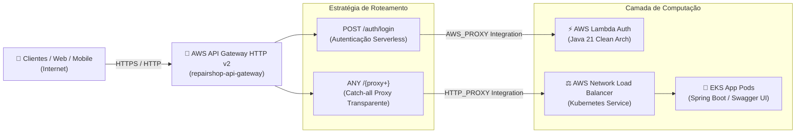
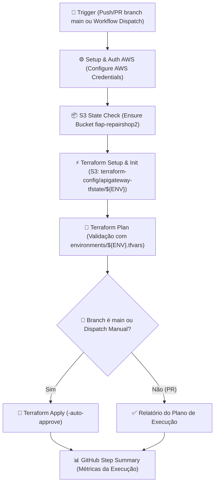

# 🚀 RepairShop — Infraestrutura do API Gateway (AWS HTTP API v2)

[](https://www.terraform.io/)
[](https://aws.amazon.com/api-gateway/)
[](https://aws.amazon.com/lambda/)
[](https://aws.amazon.com/eks/)
[](https://github.com/features/actions)

Repositório de **Infraestrutura como Código (IaC)** responsável pelo provisionamento do **AWS API Gateway (HTTP API v2)** do ecossistema **RepairShop** (FIAP Tech Challenge — Fase 3).

O API Gateway atua como o **Ponto Único de Entrada (Single Entry Point / Edge Router)** da solução, gerenciando o tráfego externo e roteando de forma transparente entre o microsserviço de autenticação Serverless (AWS Lambda) e o backend principal executando no cluster Kubernetes (Amazon EKS).

---

## 🎯 Propósito e Estratégia Arquitetural

A infraestrutura utiliza o **AWS API Gateway v2 (HTTP API)** devido à sua altíssima vazão, suporte nativo a CORS, baixa latência e custo reduzido em relação às REST APIs clássicas:

1. **Roteamento Especializado de Autenticação (`POST /auth/login`):**
   - Rota integrada diretamente à função **AWS Lambda** (`repairshop-lambda-auth`).
   - Processa a validação de CPF e credenciais, emitindo o token JWT assinado.
2. **Roteamento de Backend via Proxy Transparente (`ANY /{proxy+}`):**
   - Rota catch-all que repassa transparentemente todo o tráfego da API de negócio (`/customers`, `/vehicles`, `/service-orders`, `/insumes`, `/invoices`, `/swagger-ui/*`) para o Load Balancer do EKS.
3. **Descoberta Dinâmica de Load Balancer (Zero Hardcoding):**
   - O Terraform utiliza um Data Source AWS (`data "aws_lb" "app_k8s"`) que busca em tempo real o DNS gerado pelo Network Load Balancer (NLB) do Kubernetes através da tag:
     ```text
     kubernetes.io/service-name = "repairshop/repairshop-service"
     ```
   - Elimina acoplamento com zonas DNS do Route 53 e evita que alterações no backend exijam modificações nos contratos do API Gateway.

---

## 🏗️ Topologia da Arquitetura do API Gateway



---

## 🗂️ Estrutura de Arquivos

```text
.
├── .github/workflows/
│   ├── ci-cd-apigateway.yml  # Pipeline principal de CI/CD (Build, Test & Deploy)
│   └── destroy.yml           # Pipeline de destruição controlada com Safety Gate
├── main.tf                   # API Gateway v2, Rotas, Integrações e Data Source do LB
├── variables.tf              # Declaração das variáveis (ambiente, service_name, etc.)
├── outputs.tf                # Export da URL pública do API Gateway (`api_endpoint`)
├── providers.tf              # Configuração do provedor AWS
├── backend.tf                # Configuração do backend remoto S3
├── environments/
│   ├── dev.tfvars            # Parâmetros de Desenvolvimento
│   ├── hml.tfvars            # Parâmetros de Homologação
│   └── prd.tfvars            # Parâmetros de Produção
└── README.md
```

---

## 🚀 Pipeline de CI/CD (GitHub Actions)

A esteira de integração e entrega contínua do API Gateway é automatizada pelo workflow [`.github/workflows/ci-cd-apigateway.yml`](.github/workflows/ci-cd-apigateway.yml).

### Desenho da Pipeline CI/CD



### Detalhamento e Justificativa de Cada Passo da Pipeline

| Passo | Ação Executada | Justificativa Arquitetural |
| :--- | :--- | :--- |
| **1. Checkout repository** | Obtém o código na versão do commit. | Garante a integridade da versão dos manifests Terraform a serem aplicados. |
| **2. Configure AWS Credentials** | Autentica via IAM Secrets (`LabRole`). | Sessão segura com a AWS sem chaves estáticas gravadas no repositório. |
| **3. Ensure S3 Bucket State** | Valida a existência do bucket `fiap-repairshop2`. | Previne quebras durante a inicialização do backend remoto S3. |
| **4. Setup Terraform** | Configura a versão fixa `1.8.5` da CLI Terraform. | Reprodutibilidade e previsibilidade da infraestrutura como código. |
| **5. Terraform Init** | Inicializa os plugins e conecta ao state do API Gateway. | Garante o isolamento estrito de estado em relação aos clusters e bancos de dados. |
| **6. Terraform Plan** | Gera o plano de execução para o ambiente selecionado. | Valida se a integração com a Lambda e o Load Balancer descoberto estão corretos. |
| **7. Terraform Apply** | Aplica as configurações do API Gateway na AWS. | Deploy automatizado apenas para commits aprovados na branch `main` ou disparo manual. |
| **8. Generate Summary** | Publica os outputs (incluindo URL do Gateway) no `$GITHUB_STEP_SUMMARY`. | Dá visibilidade instantânea do endpoint público gerado para testes imediatos. |

### 💡 Decisão de Arquitetura: Estratégia de Único Job (Single Job)

> **Decisão Arquitetural:** Toda a pipeline do API Gateway roda em um **único JOB (`runs-on: ubuntu-latest`)**.
> 
> **Motivação Técnica:**
> 1. **Economia de Minutos de Execução:** Como o API Gateway provisiona recursos leves e rápidos (tempo médio de 1 a 2 minutos), dividir o pipeline em múltiplos jobs adicionaria tempo de fila para novos runners, consumindo desnecessariamente o limite da conta GitHub.
> 2. **Reaproveitamento de Estado e Contexto AWS:** Mantém as credenciais e conexões do Terraform inicializadas no runner, otimizando o tempo de feedback para o desenvolvedor.

---

## 💻 Execução e Deploy Local (Terraform CLI)

Caso deseje executar o provisionamento localmente:

```bash
# 1. Inicialize o Terraform com o backend remoto S3
terraform init \
  -backend-config="bucket=fiap-repairshop2" \
  -backend-config="key=terraform-config/apigateway-tfstate/dev/terraform.tfstate" \
  -backend-config="region=us-east-1"

# 2. Visualize o plano de execução
terraform plan -var-file="environments/dev.tfvars"

# 3. Aplique as modificações na AWS
terraform apply -var-file="environments/dev.tfvars"
```

---

## 🔗 Links e Integrações no Ecossistema

- **Swagger UI / OpenAPI 3.0:** Acessível via API Gateway em: `https://<api-gateway-id>.execute-api.us-east-1.amazonaws.com/swagger-ui/index.html`
- **Coleção Postman:** [`tech-challenge-repairshop-app/docs/postman/`](file:///c:/Users/Alexandre-AGAMIN/Projetos-%20FIAP/github-organizations-projects/tech-challenge-repairshop-app/docs/postman/)
- **Repositórios Integrados:**
  - [`tech-challenge-repairshop-lambda-auth`](https://github.com/fiap-postech-repairshop/tech-challenge-repairshop-lambda-auth) (Destino da rota `POST /auth/login`)
  - [`tech-challenge-repairshop-app`](https://github.com/fiap-postech-repairshop/tech-challenge-repairshop-app) (Destino da rota `ANY /{proxy+}`)
  - [`tech-challenge-repairshop-infra-eks`](https://github.com/fiap-postech-repairshop/tech-challenge-repairshop-infra-eks) (Cluster Kubernetes onde o Load Balancer reside)
  - [`tech-challenge-repairshop-infra-network`](https://github.com/fiap-postech-repairshop/tech-challenge-repairshop-infra-network) (Rede Base)
